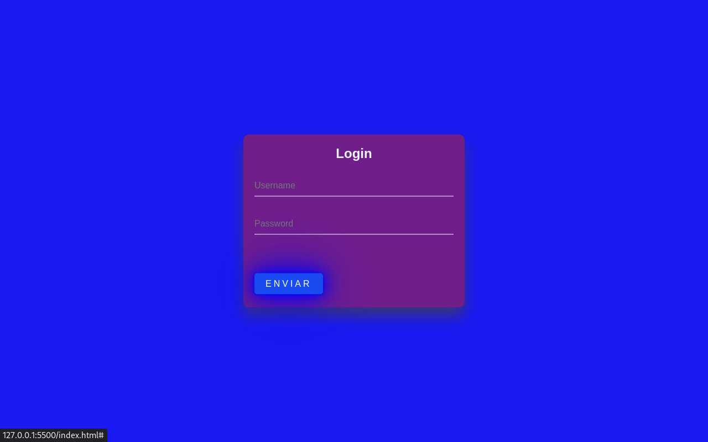

# login

# Página de Login Estilizada

Esta é uma página de login simples e estilizada usando HTML e CSS. A página possui um design atraente com efeitos visuais para tornar a experiência do usuário mais agradável.

## Conteúdo

- [Estrutura do Projeto](#estrutura-do-projeto)
- [Estilos CSS](#estilos-css)
- [Como Usar](#como-usar)

## Estrutura do Projeto

O projeto é composto por um arquivo HTML (`index.html`) e um bloco de estilos CSS embutido no cabeçalho do HTML.

- `index.html`: Contém a estrutura HTML da página, incluindo a caixa de login e o formulário.
  
## Estilos CSS

O CSS está embutido no cabeçalho do HTML para simplificar o projeto. Aqui estão alguns dos estilos aplicados:

- Configuração básica para o corpo da página.
- Estilização da caixa de login com posicionamento absoluto, sombra e bordas arredondadas.
- Estilo do título, campos de entrada e rótulos no formulário.
- Estilo do link "Enviar" com efeitos de transição e animações em spans.

## Como Usar

1. Baixe os arquivos do projeto para o seu computador.
2. Abra o arquivo `index.html` em um navegador da web.

Agora, você deve ver a página de login estilizada. Personalize conforme necessário para atender às suas necessidades.

**Observação:** Este projeto é apenas um exemplo educacional e pode ser expandido com funcionalidades adicionais, como validação de formulário e interações do usuário.

Sinta-se à vontade para explorar e adaptar o código conforme necessário para seus próprios projetos!

<h2>img 2</h2>

